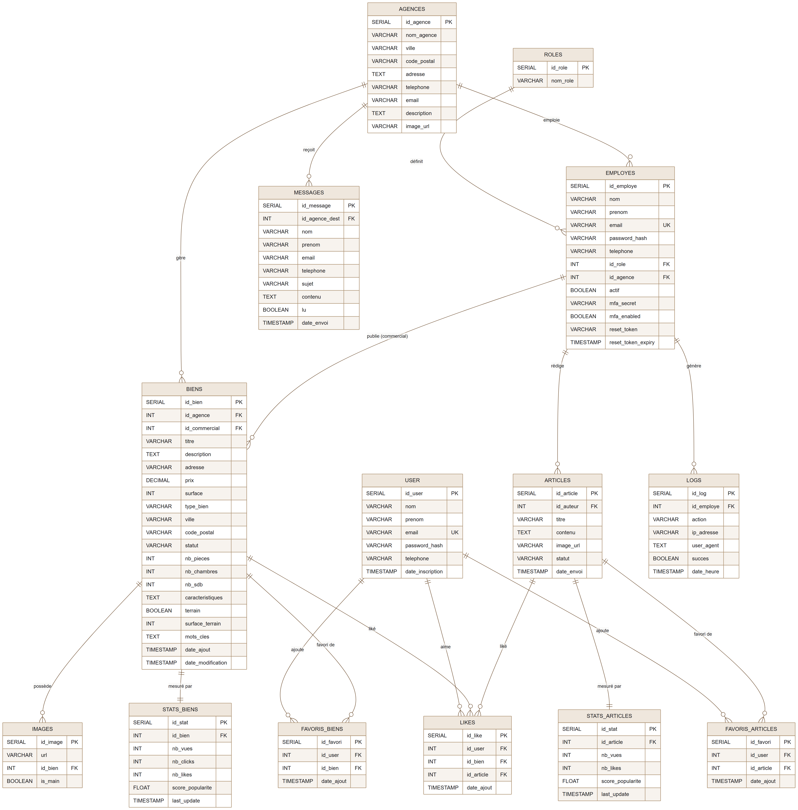

# Ymmo — Plateforme Immobilière

Projet scolaire Ynov B2 — UF INFRA & DEV.

Ymmo est une plateforme web centralisée pour un groupe immobilier fictif basé à Aix-en-Provence, avec 12 agences réparties en France. Elle permet aux clients de rechercher des biens, aux agences de gérer leurs annonces, et à la direction d'analyser les performances du réseau.

---

## Stack

| Couche | Technologie |
|--------|-------------|
| Frontend | React 18 + Vite + Tailwind CSS + Framer Motion |
| Backend | Python + FastAPI + SQLAlchemy + PostgreSQL 15 (pg8000) |
| Auth | JWT (access 15 min + refresh 7 j en cookie httpOnly) + MFA TOTP staff |
| Analyse | pandas + scikit-learn |
| Migrations | Alembic |
| Conteneurisation | Docker Compose (Postgres + API + frontend + Adminer) |
| Déploiement | Nginx + uvicorn (DMZ) |

---

## Lancer le projet

### Avec Docker (recommandé)

Ouvrir Docker Desktop, puis depuis la racine :

```bash
docker compose up --build
```

Le conteneur API joue automatiquement `alembic upgrade head` puis le seed des données de démo.

| Service | URL |
|---------|-----|
| Site React | `http://localhost:5173` |
| API FastAPI | `http://localhost:8000` |
| Swagger | `http://localhost:8000/docs` |
| Adminer (BDD) | `http://localhost:8082` |

Connexion Adminer : système `PostgreSQL`, serveur `postgres`, utilisateur `ymmo`, mot de passe `ymmo_password`, base `ymmo`.

### Sans Docker

**Frontend**

```bash
npm install
npm run dev          # http://localhost:5173
```

**Backend** (Postgres lancé via `docker compose up -d postgres`, ou SQLite par défaut sans `.env`) :

```bash
cd backend
python -m venv venv
venv\Scripts\activate            # Linux/macOS : source venv/bin/activate
pip install -r requirements.txt
copy .env.example .env           # Linux/macOS : cp .env.example .env
python -m alembic upgrade head
python -m scripts.seed
uvicorn app.main:app --reload    # http://localhost:8000 — Swagger sur /docs
```

Détails backend (variables d'env, scripts, sécurité) : [backend/README.md](backend/README.md).

---

## Comptes de démo

Mot de passe commun : `Password123!`

| Type | Email |
|------|-------|
| Client | `client@ymmo.fr` |
| Commercial | `commercial@ymmo.fr` |
| Marketing | `marketing@ymmo.fr` |
| RH | `rh@ymmo.fr` |
| Direction | `direction@ymmo.fr` |
| IT | `it@ymmo.fr` |

---

## Fonctionnalités

**Côté client**
- Recherche et filtrage de biens immobiliers
- Consultation des agences et de leurs portefeuilles
- Blog immobilier avec articles
- Formulaire de contact
- Compte personnel avec favoris

**Côté staff**
- Dashboard Commercial — gestion des annonces et messages clients
- Dashboard Marketing — gestion des articles de blog
- Dashboard RH — gestion des employés
- Dashboard Direction — statistiques globales et analyse prédictive
- Dashboard IT — administration des comptes et logs de sécurité

---

## Sécurité

- Mots de passe hachés bcrypt (cost 12) via `passlib`
- JWT access token (15 min) + refresh token (7 j) en cookie httpOnly, SameSite Strict
- MFA TOTP staff via `pyotp`
- RBAC par rôle sur les routes staff/admin
- Rate limiting du login par IP + journalisation des tentatives échouées
- CORS restreint aux origines autorisées
- Adresse des biens masquée sur `BienPublic`, visible seulement via l'endpoint staff
- Upload images limité à 5 Mo + contrôle du type MIME

---

## Schéma de la base de données



Source modifiable : [docs/bdd_schema.mmd](docs/bdd_schema.mmd) (Mermaid ERD).

---

## Équipe

- **Matias Bouchenoire** — Frontend + UX/UI
- **Samuel Bouhnik-Loury** — Backend + UX/UI + Cyber
- **William Pons** — Backend + Infra/Cyber
